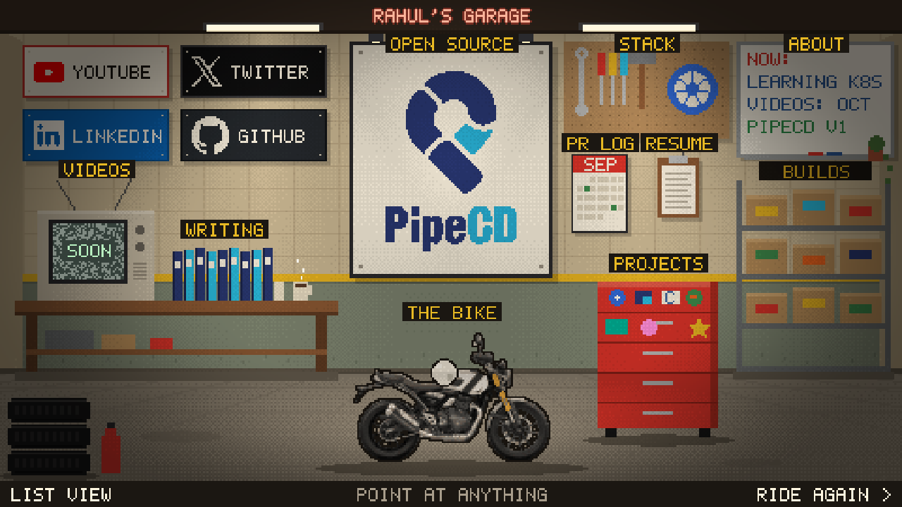

# Rahul Shendre

Personal site, built as a pixel-art garage. You arrive on a white Scrambler 400X, the sectional steel door lifts, and every object in the garage opens a real part of the site: work, open source, videos, writing, about, resume. The ride down a highway to Ladakh is one click away.



More screenshots in `docs/screenshots/` (door, night with the bike lit, the TV terminal, a section panel). Build notes in `docs/MORNING-REPORT.md`. The `v1` git tag marks the first version of this garage.

## In the garage

- Two posters on the back wall: PipeCD (open source) and PlanetRead (subtitles and apps, `/planetread`).
- Point at anything: it glows. Click: sections open in a panel over the garage (Esc or Back closes it, "Full page" opens the plain page). Outside links open in a new tab.
- The CRT TV is a terminal (`help`, `about`, `pipecd`, `open builds`, `night`, `radio`, `ride`). `/` or `` ` `` opens it from anywhere.
- Pull the cord for lights on or off. It follows the visitor's clock (dark from 7pm to 6am) until they choose, and remembers the choice.
- Click the radio for lo-fi (on by default, your choice is remembered). The SOUND button top left mutes everything. Pet the cat. A counter on the ceiling beam tracks what you have found.
- Everything is also a plain link: no JavaScript, Ctrl-click and screen readers all work. "List view" is the one-page version.

## Controls

- Door scene: about 7 seconds of arrival with wind, engine and a sensor light that opens the door. The weather changes per visit (clear, rain with lightning, snow, fog). The sky is shared: the ride, the door and the garage window show the same weather, the same land (the Himalaya, or the green hills of the old Windows XP wallpaper, "Bliss") and the same hour (day, dusk or night), so what you rode in is what you arrive in. Each scene has buttons for them (T weather, N time, B land in the ride). The two lands are not just colours: in Bliss the whitewashed shops, monasteries, Buddhas, yaks, camels and army trucks give way to cottages and a village street, a church, a castle, windmills and barns, cows, sheep, deer and rabbits, tractors and a hay truck. Crickets sing at dusk and all night (in all three scenes), birds by day, and in Bliss the cows and sheep call as you ride up to them. Browsers keep sound locked until a tap, so if it is blocked the scene waits on TAP TO START. After that any key or tap skips it. It plays once per browser tab session, then links back to `/` go straight to the garage.
- Ride (the "ride again" button): any key or tap starts it. `S` / Esc or SKIP: straight to the garage. Arrow keys, A/D or tapping screen halves steer (or let the autopilot ride). `V`, `1` `2` `3` or the camera icon: behind, rider POV, top-down. `M` or the speaker icon: engine sound.
- URLs: `/?ride` forces the ride, `/?garage` skips the door, `/?door` shows only the door, `/?door&weather=rain|snow|fog|clear` picks the weather, `&theme=xp|himalaya` the land, `&time=day|dusk|night` the hour (`/?night` and `/?day` are short forms), `/?door&at=6` jumps into the arrival, `/?nofx` turns off the WebGL glow and vignette pass, `/#terminal` opens the terminal, `/#p=%2Fopen-source` opens a section panel, `/?ride&at=700` starts at a road segment, `/?garage&og` hides the counter (share image).

## Run it

```bash
pnpm install
pnpm dev        # http://localhost:4321
pnpm test       # unit tests for the game logic
pnpm build      # static site in dist/
```

Needs Node 20+ (Astro 5). Set `SITE_URL` when deploying to your own domain (canonical links, share card and sitemap use it; on Vercel it is picked up automatically). CI (`.github/workflows/ci.yml`) runs type check, tests, build and the link check. Astro 7 needs Node 22, so upgrade Node before upgrading Astro.

## Where things live

- `src/content/builds/` one markdown file per project. Add a file, it shows up on /builds.
- `src/content/notes/` writing. Copy `_template.md`, drop the underscore.
- `src/data/site.ts` name, links, bike, TODOs.
- `src/data/github.json` GitHub snapshot. Refresh with `pnpm snapshot` (needs `gh auth login`).
- `src/game/` the canvas game: door, garage, ride. `terminal.ts` (TV commands), `panel.ts` (section panels), `hints.ts` (bottom-bar messages), `state.ts` (what the visitor has seen and found).
- `public/og.png` the share image: a top-aligned 1200x630 crop of `/?garage&day&og` at 1280x720.
- `tools/pixelate.py` turns a photo into a pixel sprite (see tools/README.md).

## Credits

- Door scene mountains: [Ama Dablam, Nepal](https://commons.wikimedia.org/wiki/File:Ama_Dablam,_Nepal.jpg) by Vyacheslav Argenberg, [CC BY 4.0](https://creativecommons.org/licenses/by/4.0/). Cropped, recoloured to a dusk palette and reduced to pixel art with `tools/backdrop.py`. The source photo is not committed (`tools/reference/` is gitignored); the credit also shows in the site footer.
