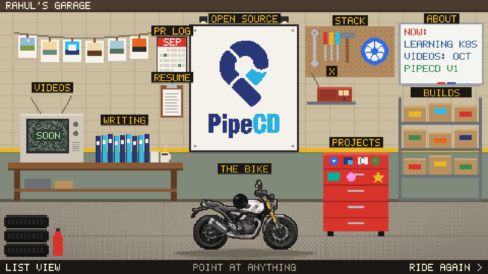

# Rahul Shendre

Personal site. A pixel-art ride down an Indian highway on a white Scrambler 400X that ends in a garage where every object links to real work.



More screenshots in `docs/screenshots/`. Overnight build notes in `docs/MORNING-REPORT.md`.

## Controls

- Any key or tap: start the ride. `S` / Esc or SKIP: straight to the garage.
- Arrow keys, A/D or tapping screen halves: steer (or let the autopilot ride).
- `V`, `1` `2` `3` or the camera icon: behind, rider POV, top-down.
- `/?ride` forces the ride, `/?garage` skips it, `/?door` shows only the door, `/?ride&og` is the share-image title.

## Run it

```bash
pnpm install
pnpm dev        # http://localhost:4321
pnpm test       # unit tests for the game logic
pnpm build      # static site in dist/
```

Needs Node 20+ (Astro 5). Astro 7 needs Node 22, so upgrade Node before upgrading Astro.

## Where things live

- `src/content/builds/` one markdown file per project. Add a file, it shows up on /builds.
- `src/content/notes/` writing. Copy `_template.md`, drop the underscore.
- `src/data/site.ts` name, links, bike, TODOs.
- `src/data/github.json` GitHub snapshot. Refresh with `pnpm snapshot` (needs `gh auth login`).
- `src/game/` the canvas game: ride, door, garage.
- `tools/pixelate.py` turns a photo into a pixel sprite (see tools/README.md).
